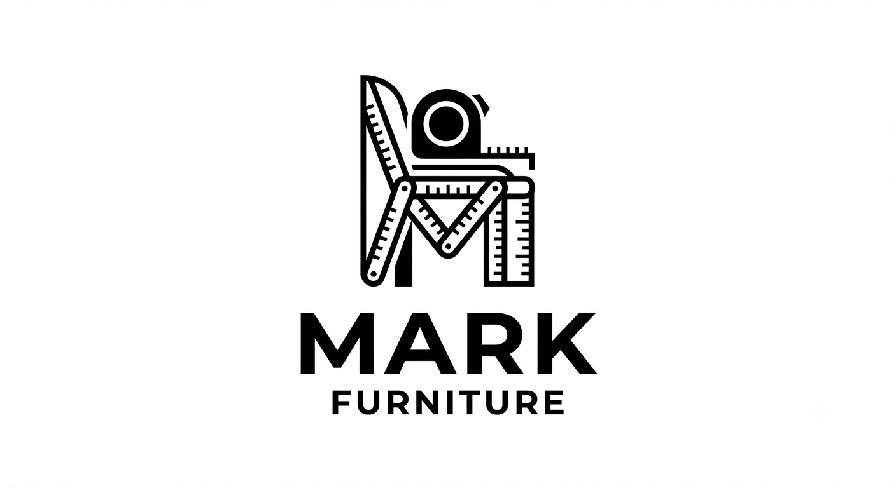
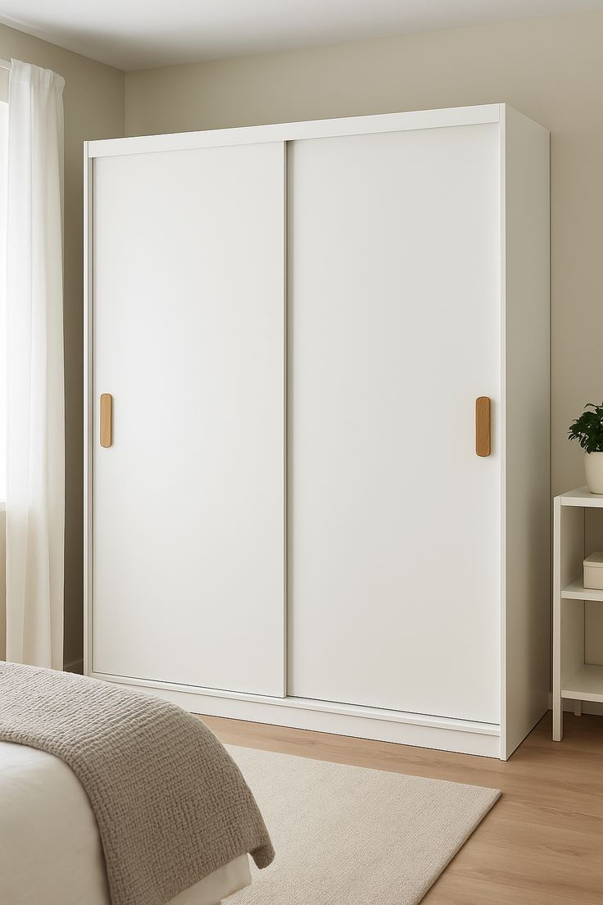
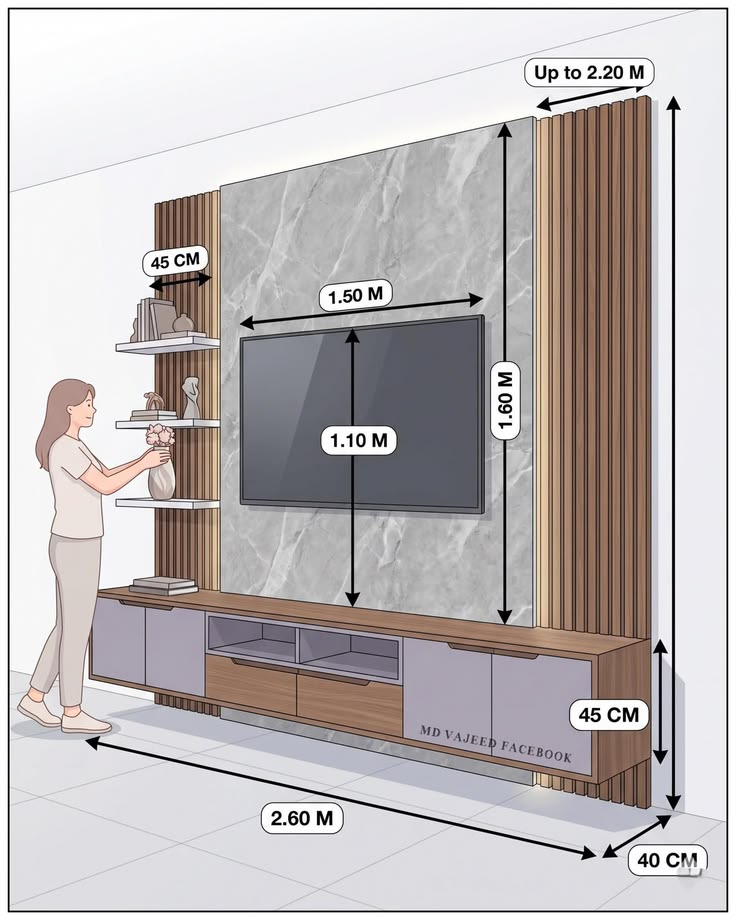

<html lang="en">
<head>
<meta charset="UTF-8">
<meta name="viewport" content="width=device-width, initial-scale=1.0">
<title>Mark Furniture - Bespoke Luxury Interior & Furniture</title>

</head>
<body>

<header>
    

        
    

    <nav id="navMenu">
        <a href="#">ዋና ገጽ / Home</a>
        <a href="#about">ስለ እኛ / About Us</a>
        <a href="#process">አሰራራችን / Process</a>
        <a href="#collections">ማሳያ ክፍል / Showroom</a>
        <a href="#testimonials">አስተያየቶች / Reviews</a>
        <a href="#faq">ጥያቄዎች / FAQ</a>
        <a href="#contact">ያግኙን / Contact</a>
    </nav>

    <button class="menu" id="menuBtn">☰</button>
</header>

<!-- Hero Section -->
<section class="hero">
    

        <h1>Crafting Luxury Spaces For Elite Living</h1>
        
በኢትዮጵያ ውስጥ ለቤትዎ፣ ለቢሮዎ እና ለቪላዎ የሚመጥኑ እጅግ ቅንጡ፣ ዘመናዊ እና ውብ የቤት ዕቃዎች በጥራትና በባለሙያ እንሰራለን።

        <a href="#contact" class="btn">ትዕዛዝ ለመስጠት / Order Now</a>
    

</section>

<!-- NEW: About Us & Material Quality Section -->
<section id="about" class="about-section">
    

        

            <!-- Free Delivery Banner -->

    🚚 የላቀ አገልግሎት — ማንኛውንም እቃ ሲያዙ ያሉበት ድረስ ያለምንም ተጨማሪ ክፍያ በነጻ እናደርሳለን! (Free Delivery Across Addis Ababa)

            <h2>ስለ ማርክ ፈርኒቸር (About Us)</h2>
            
ማርክ ፈርኒቸር በፈርኒቸር ማምረት እና በውስጥ ክፍል ማስዋብ (Interior Design) ዘርፍ ለረጅም ዓመታት ያካበተውን ልምድ በመጠቀም፣ ለደንበኞቹ እጅግ ዘመናዊ እና ጥራት ያላቸውን ምርቶች ያቀርባል። ዘመናዊ ማሽነሪዎችን በመጠቀምና እያንዳንዱን ዝርዝር ነገር በጥንቃቄ በመስራት የቤትዎ ግርማ ሞገስ እንድናድግ እናደርጋለን።

            
የእኛ ልዩ መለያ ደንበኞቻችን የሚፈልጉትን ዲዛይን ሙሉ በሙሉ በ 3D እይታ አውጥተን፣ ከመመረቱ በፊት በትክክል እንዴት እንደሚያምር ማሳየት መቻላችን ነው።

        

        

            <h3>የማቴሪያል ጥራት ዋስትና (Premium Materials)</h3>
            
ለምርቶቻችን ዘላቂነት ስንል ከፍተኛ ጥራት ያላቸውን ግብዓቶች ብቻ እንጠቀማለን፦

            <ul>
                <li>የውሃና ሙቀት መቋቋም የሚችሉ የላቁ ላሚኔሽኖች (Waterproof Lamination)</li>
                <li>ጠንካራና ታዋቂ የሀገር ውስጥ እና የውጭ ሀገር እንጨቶች</li>
                <li>ለረጅም ጊዜ ጥንካሬያቸውን የማይለቁ ምርጥ ስፖንጅና ጨርቆች</li>
                <li>ጭረት እና ስብራትን የሚቋቋሙ ፕሪሚየም ማያያዣዎች (Hardware)</li>
            </ul>
        

    

</section>

<!-- Process Section -->
<section id="process" class="process-section">
    <h2>የክብር ደንበኞቻችን የትዕዛዝ ሂደት</h2>
    
ለየት ያሉ የቤት ዕቃዎችን በጥራት እና በፍጥነት የምናመርትበት 4 ወርቃማ ደረጃዎች

    
    

        

            
1

            <h3>ዲዛይን ማወቅ</h3>
            
Bespoke Design consultation

            
የመጀመሪያው ደረጃ ከደንበኞቻችን ጋር በመመካከር በትክክል የሚፈልጉትን፣ ለቤታቸው የሚመጥነውን የፈርኒቸር ዲዛይንና መለኪያ በጥንቃቄ መለየት ነው።

        

        

            
2

            <h3>3D ሞዴል ማውጣት</h3>
            
3D Visualization & Modeling

            
የተመረጠውን ዲዛይን እጅግ ዘመናዊ የ 3D ማሳያ (3D Model) በማውጣት፣ ስራው ከመጀመሩ በፊት ለደንበኛው በምስል እናሳይዎታለን።

        

        

            
3

            <h3>ትክክለኛ ዋጋ ማሳወቅ</h3>
            
Transparent Quotation

            
የእቃው ዝርዝርና ዲዛይን ከጸደቀ በኋላ፣ ያለምንም የተደበቀ ክፍያ ትክክለኛውንና ተመጣጣኝ የሆነውን ዋጋ በግልጽ እናሳውቃለን።

        

        

            
4

            <h3>በ2 ሳምንት ማድረስ</h3>
            
Guaranteed 2-Week Delivery

            
ትዕዛዝዎን በከፍተኛ ጥራትና ጥንቃቄ አጠናቀን በ2 ሳምንት ባልሞላ ሙሉ ጊዜ ውስጥ ያሉበት ድረስ በፍጥነት እናስረክባለን።

        

    

</section>
<!-- Collections & Services Section -->
<section id="collections" class="categories">
    <h2>የቅንጦት ምርቶች እና አገልግሎቶች ማሳያ</h2>
    
ከምርጥ እንጨቶች እና ዘመናዊ ግብዓቶች የተሰሩ የፈርኒቸር ስብስቦች ለላቀ የትዕዛዝ ስራ (Our Premium Showcase)

    
    

        <!-- Card 1: Sofa -->
        

            

                
                <h3>የቅንጦት ሶፋ ስብስቦች</h3>
                
Luxury Sofa & Lounge Sets

                
በከፍተኛ ጥራት ከተመረጡ ውድ ጨርቆች እና ዘላቂ ስፖንጅዎች የተሰሩ፣ ለሳሎንዎ ልዩ ድምቀት እና ምቾት የሚሰጡ ሶፋዎች።

            

            <a href="https://t.me/lanyisu1?text=ሰላም%20ማርክ%20ፈርኒቸር፣%20የሶፋ%20ስብስቦችን%20ማዘዝ%20ወይም%20ዋጋ%20ጠይቅ%20ፈልጌ%20ነበር።" target="_blank" class="card-btn">በቴሌግራም እዘዝ / Order via TG</a>
        

        <!-- Card 2: Bed -->
        

            

                
                <h3>ማራኪ የአልጋ ስብስቦች</h3>
                
Premium Bedroom Masterpieces

                
ለመኝታ ቤትዎ ንጉሳዊ ክብርን የሚያጎናጽፉ፣ ከጠንካራ እንጨት የተሰሩና ዘመናዊ ስታይል ያላቸው ውብ አልጋዎች።

            

            <a href="https://t.me/lanyisu1?text=ሰላም%20ማርክ%20ፈርኒቸር፣%20የአልጋ%20ስብስቦችን%20ማዘዝ%20ወይም%20ዋጋ%20ጠይቅ%20ፈልጌ%20ነበር።" target="_blank" class="card-btn">በቴሌግራም እዘዝ / Order via TG</a>
        

        <!-- Card 3: TV Stand -->
        

            

                
                <h3>ዘመናዊ የቲቪ ማስቀመጫዎች</h3>
                
Premium TV Units & Consoles

                
ለሳሎንዎ ዘመናዊ መልክ የሚሰጡ፣ ሽቦዎችን የሚደብቁ እና ተጨማሪ መደርደሪያዎች ያሏቸው የላቁ የቲቪ ስታንዶች።

            

            <a href="https://t.me/lanyisu1?text=ሰላም%20ማርክ%20ፈርኒቸር፣%20የቲቪ%20ማስቀመጫዎችን%20ማዘዝ%20ወይም%20ዋጋ%20ጠይቅ%20ፈልጌ%20ነበር።" target="_blank" class="card-btn">በቴሌግራም እዘዝ / Order via TG</a>
        

        <!-- Card 4: Kitchen Cabinet -->
        

            

                
                <h3>የተዋቡ የኩሽና ካቢኔቶች</h3>
                
Bespoke Kitchen Cabinets

                
የማብሰያ ክፍልዎን ሰፊ፣ ምቹ እና ማራኪ የሚያደርጉ፣ ውሃና ሙቀት የሚቋቋሙ ዘመናዊ የካቢኔት ስራዎች።

            

            <a href="https://t.me/lanyisu1?text=ሰላም%20ማርክ%20ፈርኒቸር፣%20የኩሽና%20ካቢኔት%20ስራዎችን%20ማዘዝ%20ወይም%20ዋጋ%20ጠይቅ%20ፈልጌ%20ነበር።" target="_blank" class="card-btn">በቴሌግራም እዘዝ / Order via TG</a>
        

        <!-- Card 5: Dining Table -->
        

            

                
                <h3>የምግብ ጠረጴዛ ስራዎች</h3>
                
Elegant Dining Tables

                
ከቤተሰብ እና ከወዳጅ ጋር የሚያሳልፉትን ጊዜ የሚያጣፍጡ፣ ከላቁ ማቴሪያሎች የተሰሩ ውብ የምግብ ጠረጴዛዎች።

            

            <a href="https://t.me/lanyisu1?text=ሰላም%20ማርክ%20ፈርኒቸር፣%20የምግብ%20ጠረጴዛዎችን%20ማዘዝ%20ወይም%20ዋጋ%20ጠይቅ%20ፈልጌ%20ነበር።" target="_blank" class="card-btn">በቴሌግራም እዘዝ / Order via TG</a>
        

        <!-- Card 6: Dressing Table -->
        

            

                
                <h3>የልብስ መቀየሪያና ሜካፕ ጠረጴዛ</h3>
                
Luxury Vanity & Dressing Tables

                
ዘመናዊ መስተዋት እና ሰፊ የእቃ ማደራጃ መሳቢያዎች ያሏቸው፣ ለመኝታ ቤት ውበት የሚጨምሩ ድንቅ ስራዎች።

            

            <a href="https://t.me/lanyisu1?text=ሰላም%20ማርክ%20ፈርኒቸር፣%20የልብስ%20መቀየሪያና%20ሜካፕ%20ጠረጴዛዎች%20ማዘዝ%20ወይም%20ዋጋ%20ጠይቅ%20ፈልጌ%20ነበር።" target="_blank" class="card-btn">በቴሌግራም እዘዝ / Order via TG</a>
        

        <!-- Card 7: Table -->
        

            

                
                <h3>የማዕዘን እና የቢሮ ጠረጴዛዎች</h3>
                
Executive Desks & Coffee Tables

                
ለሳሎን ማጀቢያ የሚሆኑ ማራኪ የቡና ጠረጴዛዎች እንዲሁም ለስራ ቦታዎ ግርማ ሞገስ የሚሰጡ የቢሮ ጠረጴዛዎች።

            

            <a href="https://t.me/lanyisu1?text=ሰላም%20ማርክ%20ፈርኒቸር፣%20የቢሮና%20የማዕዘን%20ጠረጴዛዎችን%20ማዘዝ%20ወይም%20ዋጋ%20ጠይቅ%20ፈልጌ%20ነበር።" target="_blank" class="card-btn">በቴሌግራም እዘዝ / Order via TG</a>
        

        <!-- Card 8: Door -->
        

            

                
                <h3>ጠንካራ የቤት በሮች</h3>
                
Architectural Wooden Doors

                
ለቤትዎ አስተማማኝ ጥበቃ እና ውጫዊ ውበት የሚሰጡ፣ ከተመረጡ ጠንካራ እንጨቶች የተሰሩ ፕሪሚየም በሮች።

            

            <a href="https://t.me/lanyisu1?text=ሰላም%20ማርክ%20ፈርኒቸር፣%20ጠንካራ%20የቤት%20በሮችን%20ማዘዝ%20ወይም%20ዋጋ%20ጠይቅ%20ፈልጌ%20ነበር።" target="_blank" class="card-btn">በቴሌግራም እዘዝ / Order via TG</a>
        

        <!-- Card 9: Modern Lines -->
        

            

                
                <h3>የጌጣጌጥ መስመሮች (ወረንቶዎች)</h3>
                
Luxury Wall Slats & Design Lines

                
ለቲቪ ጀርባ እና ለግድግዳ ማሳመሪያ የሚሆኑ፣ አሁን ላይ በዘመናዊ ቤቶች ውስጥ በስፋት የሚፈለጉ ማራኪ መስመሮች።

            

            <a href="https://t.me/lanyisu1?text=ሰላም%20ማርክ%20ፈርኒቸር፣%20የጌጣጌጥ%20መስመሮች%20(ወረንቶዎች)%20ማዘዝ%20ወይም%20ዋጋ%20ጠይቅ%20ፈልጌ%20ነበር።" target="_blank" class="card-btn">በቴሌግራም እዘዝ / Order via TG</a>
        

        <!-- Card 10: 3D Design -->
        

            

                
                <h3>የ 3D ዲዛይን እና የውስጥ ክፍል ማስዋብ</h3>
                
Elite 3D Modeling & Interior Design

                
ማንኛውም ስራ ከመጀመሩ በፊት በኮምፒውተር እውነተኛ እይታ (High-end 3D Render) አውጥተን መላውን የቤትዎን ክፍል እናስውባለን።

            

            <a href="https://t.me/lanyisu1?text=ሰላም%20ማርክ%20ፈርኒቸር፣%20የ3D%20ዲዛይንና%20ኢንቴሪየር%20ስራዎችን%20ማዘዝ%20ወይም%20ዋጋ%20ጠይቅ%20ፈልጌ%20ነበር።" target="_blank" class="card-btn">በቴሌግራም እዘዝ / Order via TG</a>
        

    

</section>

<!-- NEW: Customer Testimonials Section -->
<section id="testimonials" class="testimonials">
    <h2>የክብር ደንበኞቻችን ምስክርነት (Testimonials)</h2>
    

        

            
“

            
ለአዲሱ ቤታችን የኩሽና ካቢኔት እና ሶፋ ያሰራነው እዚህ ነው። ስራው ከመጀመሩ በፊት በ 3D ያሳዩን እይታ እና በተጨባጭ የተሰራው እቃ አንድ አይነት ነው! በጥራታቸው በጣም ረክተናል።

            <h4>ዮናስ አልሙ</h4>
            አዲስ አበባ፣ ቪላ ባለቤት
        

        

            
“

            
የቲቪ ስታንድ እና የጌጣጌጥ ግድግዳ መስመሮች አሰርቻለሁ። በ2 ሳምንት ውስጥ በነጻ ትራንስፖርት ያሉበት ድረስ ማድረሳቸው እና የፊኒሺንግ ጥራታቸው እጅግ አስደንቆኛል። ለሁሉም ሰው እመክራቸዋለሁ።

            <h4>ሄለን ተስፋዬ</h4>
            አፓርትመንት ነዋሪ
        

    

</section>

<!-- NEW: FAQ Section -->
<section id="faq" class="faq-section">
    <h2>በተደጋጋሚ የሚጠየቁ ጥያቄዎች (FAQ)</h2>
    

        

            
የራሳችንን የተለየ ዲዛይን ብናመጣ ትሰራላችሁ?

            
አዎ፣ ሙሉ በሙሉ የትኛውንም ያመጡትን ዲዛይን የእርስዎን ቤት ልኬት መሰረት አድርገን በጥራት እንሰራለን። በተጨማሪም ስራው ከመጀመሩ በፊት በ3D አውጥተን እናሳየዎታለን።

        

        

            
የክፍያ አፈጻጸማችሁ እንዴት ነው?

            
ትዕዛዝ በሚሰጡበት ጊዜ ለጥሬ ዕቃ ግዢ የሚሆን የተወሰነ መቶኛ ቅድመ ክፍያ (Advance Payment) የሚከፈል ሲሆን፣ ቀሪውን ክፍያ ሙሉ ስራው አልቆ ያሉበት ድረስ በነጻ አድርሰን እቃውን ሲረከቡ የሚፈጽሙት ይሆናል።

        

        

            
ከአዲስ አበባ ውጪ ያሉ ከተሞች ላይ ትዕዛዝ ትቀበላላችሁ?

            
አዎ፣ ከአዲስ አበባ ውጪ ላሉ ከተሞች ትዕዛዝ እንቀበላለን። ነገር ግን የነጻ ማመላለሻ (Free Delivery) አገልግሎታችን ለአዲስ አበባ ዙሪያ ብቻ ሲሆን፣ ከከተማ ውጪ ላሉት በተመጣጣኝ የትራንስፖርት ክፍያ እናደርሳለን።

        

    

</section>

<!-- Contact Section (Updated with Location Layout) -->
<section id="contact" class="contact">
    <h2>ትዕዛዝ ለመስጠት እና እኛን ለማግኘት</h2>
    
📍 አድራሻችን፦ አዲስ አበባ፣ ኢትዮጵያ (ዋናው ዎርክሾፕ እና ማሳያ ቦታ)

    

        <a href="tel:+251991710545" class="contact-method">📞 +251 991 710 545</a>
        <a href="tel:+251911664492" class="contact-method">📞 +251 911 664 492</a>
        <a href="mailto:yisuteka@gmail.com" class="contact-method">📧 yisuteka@gmail.com</a>
        <a href="https://instagram.com/lan_yisu" target="_blank" class="contact-method">Instagram: @lan_yisu</a>
        <a href="https://t.me/lanyisu1" target="_blank" class="contact-method">Telegram: @lanyisu1</a>
    

</section>

<!-- NEW: Floating Telegram Chat Button -->
<a href="https://t.me/lanyisu1" target="_blank" class="floating-chat" title="Chat on Telegram">✈</a>

<footer>
    
© 2026 Mark Furniture. All Rights Reserved. Crafted with Luxury in Mind.

</footer>

<!-- JavaScript for Hamburger Menu & FAQ Accordion -->

<!-- ======================================================== -->
<!-- አዲስ፡ የአስተያየት እና የኮከብ (5-Star Rating) መስጫ ክፍል -->
<!-- ======================================================== -->
<section id="user-feedback" class="feedback-section">
    

        <h2>እርስዎም አስተያየትዎን ያጋሩን (Leave a Review)</h2>
        
የእርስዎ አስተያየት ለእኛ ትልቅ ዋጋ አለው። እባክዎ የ5 ኮከብ ደረጃ እና አጭር አስተያየት ይተውልን።

        
        <form id="feedbackForm">
            <!-- Star Rating System -->
            

                ★
                ★
                ★
                ★
                ★
            

            <!-- Hidden input to store rating value -->
            <input type="hidden" id="selectedRating" value="0">
            
            <!-- Input Fields -->
            <input type="text" id="reviewerName" placeholder="የእርስዎ ስም (Your Name)" required>
            <textarea id="reviewerComment" rows="4" placeholder="የእርስዎ አስተያየት (Your Comment...)" required></textarea>
            
            <button type="submit" class="submit-feedback-btn">አስተያየት አቅርብ / Submit Review</button>
        </form>

        <!-- Display Area for Submitted Comments -->
        

            <h3>የደንበኞች የቅርብ ጊዜ አስተያየቶች</h3>
            

                <!-- አዳዲስ አስተያየቶች በጃቫስክሪፕት አማካኝነት እዚህ ውስጥ ይገባሉ -->
            

        

    

</section>

</body>
</html>
